姓名：赖钰

学号：201810414202

班级：18软工2班

# 实验一

## 实验目的
掌握用户管理、角色管理、权根维护与分配的能力，掌握用户之间共享对象的操作技能
## 实验内容
Oracle有一个开发者角色resource，可以创建表、过程、触发器等对象，但是不能创建视图。本训练要求：
* 在pdborcl插接式数据中创建一个新的本地角色con_res_view，该角色包含connect和resource角色，同时也包含CREATE VIEW权限，这样任何拥有con_res_view的用户就同时拥有这三种权限。
* 创建角色之后，再创建用户new_user，给用户分配表空间，设置限额为50M，授予con_res_view角色。
* 最后测试：用新用户new_user连接数据库、创建表，插入数据，创建视图，查询表和视图的数据。

## 实验步骤
### 步骤1：
以system登录到pdborcl，创建角色laiyu_res_view和用户laiyu，并授权和分配空间：
#### sql语句
```sql
    CREATE ROLE laiyu_res_view;//创建角色laiyu_res_view
    GRANT connect,resource,CREATE VIEW TO laiyu_res_view;//分配权限给laiyu_res_view
    CREATE USER laiyu IDENTIFIED BY 123 DEFAULT TABLESPACE users TEMPORARY TABLESPACE temp;//创建用户
    ALTER USER laiyu QUOTA 50M ON users; //分配空间额度
    GRANT laiyu_res_view TO laiyu;
```
#### 执行结果
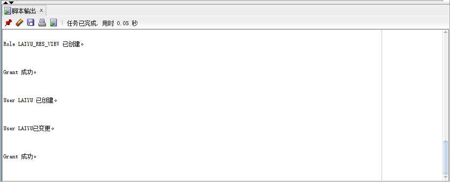
### 步骤2：
新用户laiyu连接到czm，创建表mytable和视图myview，插入数据，最后将myview的SELECT对象权限授予hr用户。
#### 使用laiyu连接czm
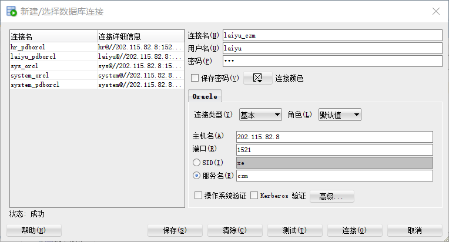
#### sql语句
```sql
show user;
CREATE TABLE mytable (id number,name varchar(50));
INSERT INTO mytable(id,name)VALUES(1,'zhong');
INSERT INTO mytable(id,name)VALUES (2,'yang');
CREATE VIEW myview AS SELECT name FROM mytable;
SELECT * FROM myview;
GRANT SELECT ON myview TO hr;
```
#### 执行结果
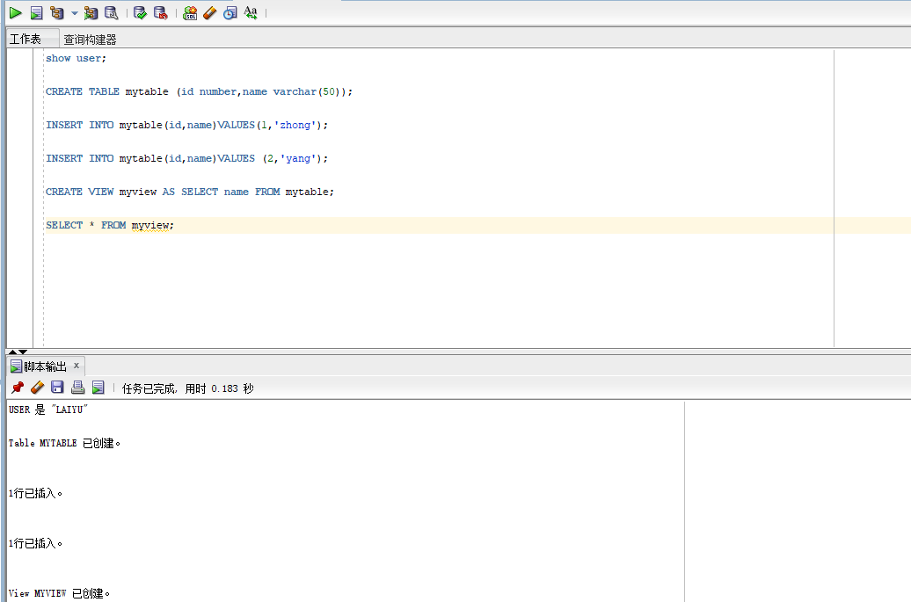
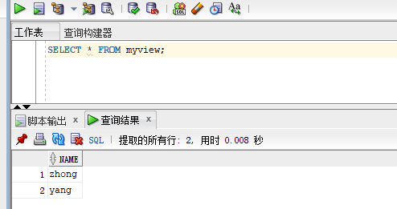
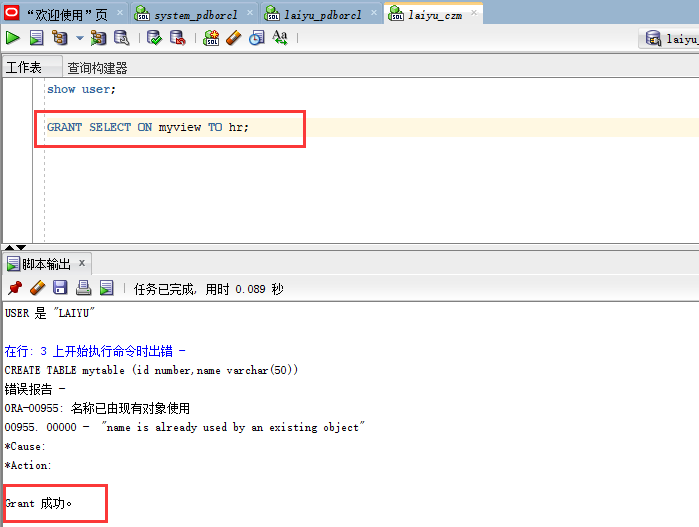

### 步骤3：
用户hr连接到czm，查询laiyu授予它的视图myview

#### hr连接czm
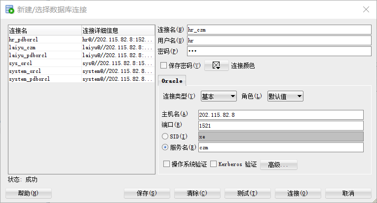

#### 查询
```sql
 SELECT * FROM laiyu.myview;
```
#### 查询结果
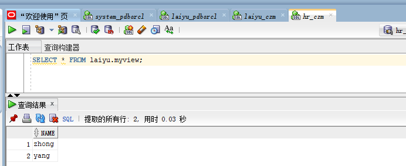

### 步骤4
测试一下同学用户之间的表的共享，只读共享和读写共享都测试一下。
#### 共享只读

1、把我的myview的读权限授权给yudan
```sql
GRANT SELECT ON myview TO yudan;
```
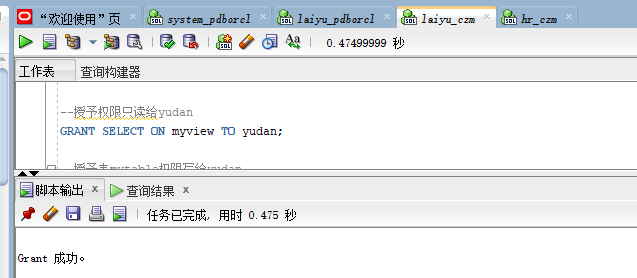

2、yudan将她的读权限授予给我后，我查询
```sql
SELECT * FROM yudan.myview;
```
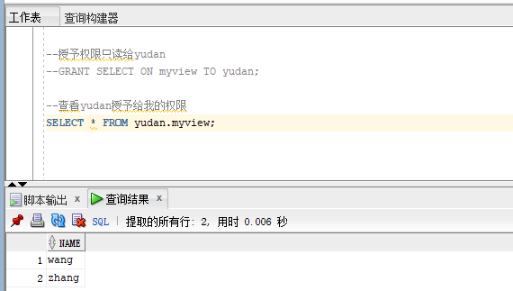

#### 读写共享

1、我把我mytable表的写权限授权给yudan
```sql
GRANT INSERT ON mytable TO yudan;
```
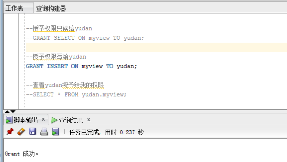

2、yudan将她的写权限授予给我后，我插入并查询
```sql
INSERT INTO yudan.mytable(id,name)VALUES (2,'lai');
SELECT * FROM yudan.myview;
```
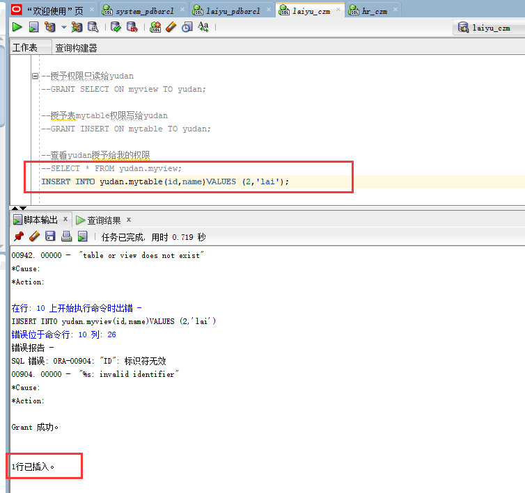
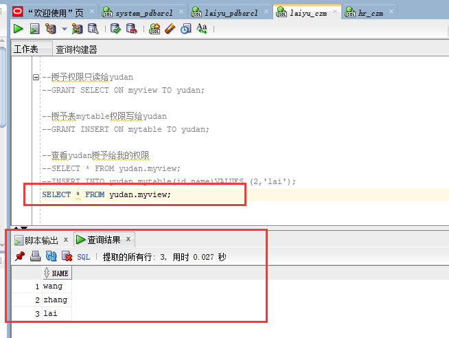

