# 实验6：川菜馆外卖系统数据库设计

## 一、项目数据库设计
### 1.1 引言
 随着互联网的快速普及，各种行业都迎来了与互联网结合的时代，饮食行业自然也不例外。所以，如今外卖行业也越来越火热，饭店除了线下的营业，还可以通过线上线下结合，为自己吸引更多的客户，带来更多的利益。
 ### 1.2 项目概述
 本项目是基于Oracle的小型外卖系统的数据库设计，包括三大部门（后厨部，服务部，配送部）及其与客户之间的联系，后厨部主要是主厨与厨师助理等角色，服务部主要是店长与前台等角色，配送部主要是数名外卖配送员角色，以及菜单的信息都将在数据库设计中进行完成。
## 二、表设计

### 2.1实体模型
根据应用场景分析，共有3个实体，它们是部门、员工产品
* 部门（DEPARTMENTS）：部门包括部门ID（DEPARTMENT_ID）和部门名字（DEPARTMENT_NAME）
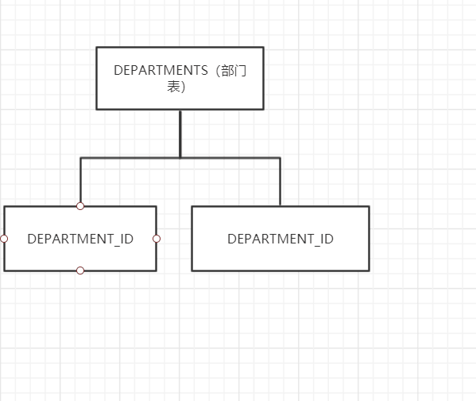

* 员工（EMPLOYEES）:员工包括员工ID（EMPLOY_ID）、姓名(NAME)、工资(SALARY)、照片(PHOTO)、电话号码(PHONE_NUMBER)、部门ID(DEPARTMENT_ID)、上司ID(MANAGER_ID)、邮箱(EMAIL)、雇佣日期(HIRE_DATE)。
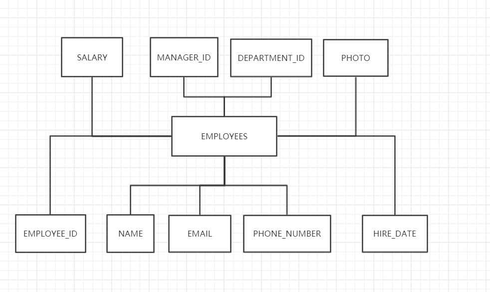
* 菜品（PRODUCT）:菜品有三个属性，菜品ID（PRODUCT_ID）、菜名(PRODUCT_NAME)、菜品类别(PRODUCT_TYPE)。
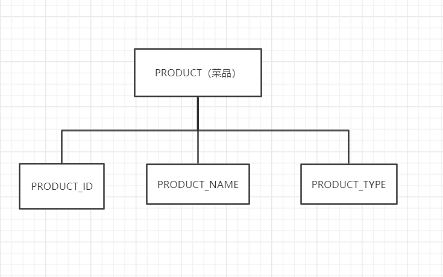
### 2.2数据表设计
一共6个表设计，部门表、员工表、产品表、订单表、订单详情表、临时订单表
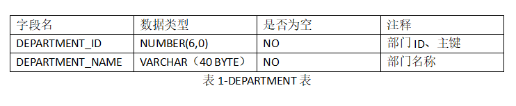
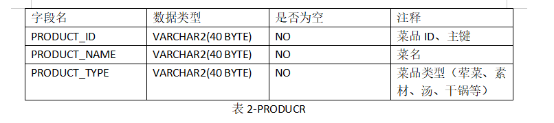
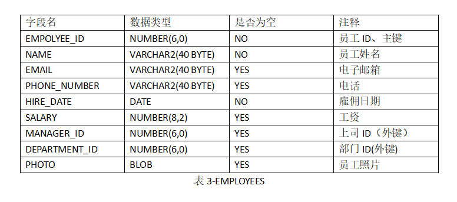
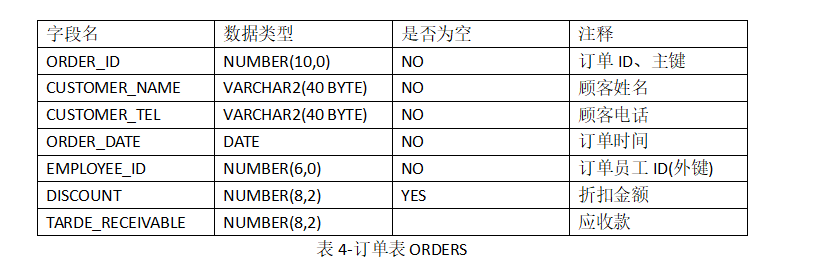
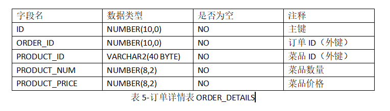
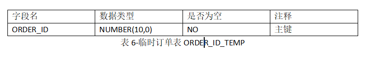

### 2.3 数据库关系图
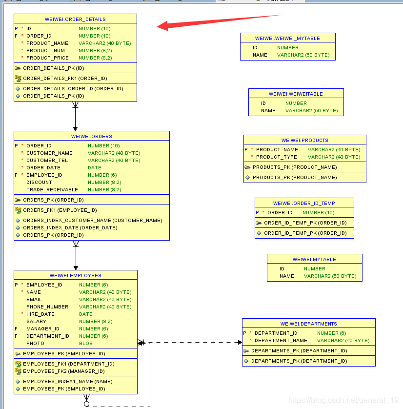

## 三、操作实现
### 3.1 用户创建与空间分配
* 步骤1：

查询pdborcl数据库中的所有表空间

```sql
    SELECT TABLESPACE_NAME,STATUS,CONTENTS,LOGGING 
    FROM dba_tablespaces;
```

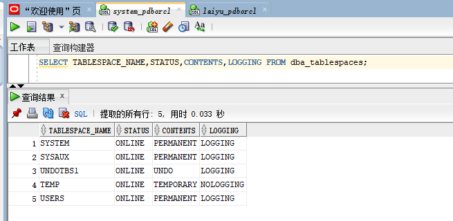

可以看出目前只有表空间USERS，没有USERS02,USERS03，所以需要创建。

* 步骤2：

创建表空间USERS02，USERS03.

```sql
--创建USERS02
CREATE TABLESPACE USERS02 DATAFILE
'/home/oracle/app/oracle/oradata/orcl/pdborcl/pdbtest_user02_1.dbf'
SIZE 100M
AUTOEXTEND ON
NEXT 50M
MAXSIZE UNLIMITED,
'/home/oracle/app/oracle/oradata/orcl/pdborcl/pdbtest_user02_2.dbf'
SIZE 100M
AUTOEXTEND ON
NEXT 50M
MAXSIZE UNLIMITED
EXTENT MANAGEMENT LOCAL SEGMENT SPACE MANAGEMENT AUTO;

--创建USERS03
CREATE TABLESPACE USERS03 DATAFILE
'/home/oracle/app/oracle/oradata/orcl/pdborcl/pdbtest_user03_1.dbf'
SIZE 100M
AUTOEXTEND ON
NEXT 50M
MAXSIZE UNLIMITED,
'/home/oracle/app/oracle/oradata/orcl/pdborcl/pdbtest_user02_2.dbf'
SIZE 100M
AUTOEXTEND ON
NEXT 50M
MAXSIZE UNLIMITED
EXTENT MANAGEMENT LOCAL SEGMENT SPACE MANAGEMENT AUTO;
```

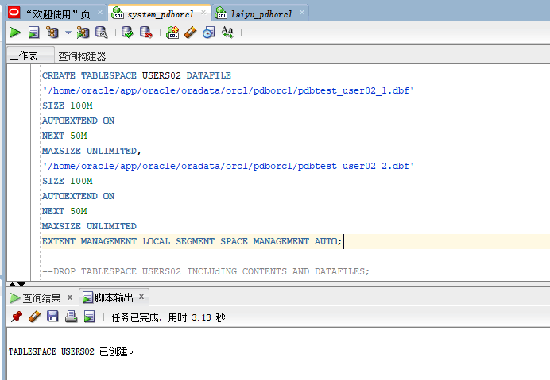
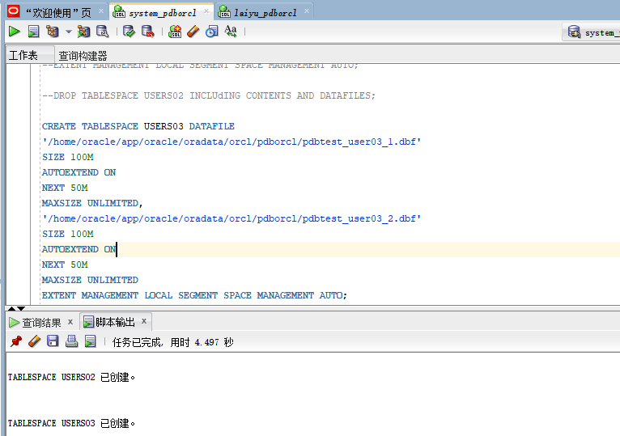


* 以system登录到pdborcl，让用户laiyu使用3个表空间：USERS,USERS02,USERS03。在表空间中创建两张表：订单表(orders)与订单详情表(order_details)。
```sql
ALTER USER laiyu QUOTA UNLIMITED ON USERS;
ALTER USER laiyu QUOTA UNLIMITED ON USERS02;
ALTER USER laiyu QUOTA UNLIMITED ON USERS03;
```
在system权限下给用户laiyu设置了可以使用表空间USERS,USERS02,USERS03的权限，并且分配空间大小没有限制。


### 3.2建表，约束和索引
* 创建表orders，以及创建7个以时间为条件的分区。
```sql
CREATE TABLE ORDERS
(
  ORDER_ID NUMBER(10, 0) NOT NULL
, CUSTOMER_NAME VARCHAR2(40 BYTE) NOT NULL
, CUSTOMER_TEL VARCHAR2(40 BYTE) NOT NULL
, ORDER_DATE DATE NOT NULL
, EMPLOYEE_ID NUMBER(6, 0) NOT NULL
, DISCOUNT NUMBER(8, 2) DEFAULT 0
, TRADE_RECEIVABLE NUMBER(8, 2) DEFAULT 0
, CONSTRAINT ORDERS_PK PRIMARY KEY
  (
    ORDER_ID
  )
  USING INDEX
  (
      CREATE UNIQUE INDEX ORDERS_PK ON ORDERS (ORDER_ID ASC)
      LOGGING
      TABLESPACE USERS
      PCTFREE 10
      INITRANS 2
      STORAGE
      (
        BUFFER_POOL DEFAULT
      )
      NOPARALLEL
  )
  ENABLE
)
TABLESPACE USERS
PCTFREE 10
INITRANS 1
STORAGE
(
  BUFFER_POOL DEFAULT
)
NOCOMPRESS
NOPARALLEL
PARTITION BY RANGE (ORDER_DATE)
(
  PARTITION PARTITION_2015 VALUES LESS THAN (TO_DATE(' 2016-01-01 00:00:00', 'SYYYY-MM-DD HH24:MI:SS', 'NLS_CALENDAR=GREGORIAN'))
  NOLOGGING
  TABLESPACE USERS
  PCTFREE 10
  INITRANS 1
  STORAGE
  (
    INITIAL 8388608
    NEXT 1048576
    MINEXTENTS 1
    MAXEXTENTS UNLIMITED
    BUFFER_POOL DEFAULT
  )
  NOCOMPRESS NO INMEMORY
, PARTITION PARTITION_2016 VALUES LESS THAN (TO_DATE(' 2017-01-01 00:00:00', 'SYYYY-MM-DD HH24:MI:SS', 'NLS_CALENDAR=GREGORIAN'))
  NOLOGGING
  TABLESPACE USERS
  PCTFREE 10
  INITRANS 1
  STORAGE
  (
    BUFFER_POOL DEFAULT
  )
  NOCOMPRESS NO INMEMORY
, PARTITION PARTITION_2017 VALUES LESS THAN (TO_DATE(' 2018-01-01 00:00:00', 'SYYYY-MM-DD HH24:MI:SS', 'NLS_CALENDAR=GREGORIAN'))
  NOLOGGING
  TABLESPACE USERS
  PCTFREE 10
  INITRANS 1
  STORAGE
  (
    BUFFER_POOL DEFAULT
  )
  NOCOMPRESS NO INMEMORY
, PARTITION PARTITION_2018 VALUES LESS THAN (TO_DATE(' 2019-01-01 00:00:00', 'SYYYY-MM-DD HH24:MI:SS', 'NLS_CALENDAR=GREGORIAN'))
  NOLOGGING
  TABLESPACE USERS02
  PCTFREE 10
  INITRANS 1
  STORAGE
  (
    BUFFER_POOL DEFAULT
  )
  NOCOMPRESS NO INMEMORY
, PARTITION PARTITION_2019 VALUES LESS THAN (TO_DATE(' 2020-01-01 00:00:00', 'SYYYY-MM-DD HH24:MI:SS', 'NLS_CALENDAR=GREGORIAN'))
  NOLOGGING
  TABLESPACE USERS02
  PCTFREE 10
  INITRANS 1
  STORAGE
  (
    BUFFER_POOL DEFAULT
  )
  NOCOMPRESS NO INMEMORY
, PARTITION PARTITION_2020 VALUES LESS THAN (TO_DATE(' 2021-01-01 00:00:00', 'SYYYY-MM-DD HH24:MI:SS', 'NLS_CALENDAR=GREGORIAN'))
  NOLOGGING
  TABLESPACE USERS02
  PCTFREE 10
  INITRANS 1
  STORAGE
  (
    BUFFER_POOL DEFAULT
  )
  NOCOMPRESS NO INMEMORY
, PARTITION PARTITION_2021 VALUES LESS THAN (TO_DATE(' 2022-01-01 00:00:00', 'SYYYY-MM-DD HH24:MI:SS', 'NLS_CALENDAR=GREGORIAN'))
  NOLOGGING
  TABLESPACE USERS03
  PCTFREE 10
  INITRANS 1
  STORAGE
  (
    BUFFER_POOL DEFAULT
  )
  NOCOMPRESS NO INMEMORY
);
```

* 创建order_details表，表段放在表空间USERS中，分区依赖外键order_id。
  
  
  ```sql
  CREATE TABLE order_details
  (
  id NUMBER(10, 0) NOT NULL
  , order_id NUMBER(10, 0) NOT NULL
  , product_name VARCHAR2(40 BYTE) NOT NULL
  , product_num NUMBER(8, 2) NOT NULL
  , product_price NUMBER(8, 2) NOT NULL
  , CONSTRAINT order_details_fk1 FOREIGN KEY  (order_id)
  REFERENCES orders  (  order_id   )
  ENABLE
  )
  TABLESPACE USERS
  PCTFREE 10 INITRANS 1
  STORAGE (BUFFER_POOL DEFAULT )
  NOCOMPRESS NOPARALLEL
  PARTITION BY REFERENCE (order_details_fk1);
  ```
  

* 在perfectism用户下创建DEPARTMENTS、EMPLOYEES表。
```sql
----创建DEPARTMENTS表
CREATE TABLE DEPARTMENTS
(
  DEPARTMENT_ID NUMBER(6, 0) NOT NULL
, DEPARTMENT_NAME VARCHAR2(40 BYTE) NOT NULL
, CONSTRAINT DEPARTMENTS_PK PRIMARY KEY
  (
    DEPARTMENT_ID
  )
  USING INDEX
  (
      CREATE UNIQUE INDEX DEPARTMENTS_PK ON DEPARTMENTS (DEPARTMENT_ID ASC)
      NOLOGGING
      TABLESPACE USERS
      PCTFREE 10
      INITRANS 2
      STORAGE
      (
        INITIAL 65536
        NEXT 1048576
        MINEXTENTS 1
        MAXEXTENTS UNLIMITED
        BUFFER_POOL DEFAULT
      )
      NOPARALLEL
  )
  ENABLE
)
NOLOGGING
TABLESPACE USERS
PCTFREE 10
INITRANS 1
STORAGE
(
  INITIAL 65536
  NEXT 1048576
  MINEXTENTS 1
  MAXEXTENTS UNLIMITED
  BUFFER_POOL DEFAULT
)
NOCOMPRESS NO INMEMORY NOPARALLEL;
```

```sql
--创建EMPLOYEES表
CREATE TABLE EMPLOYEES
(
  EMPLOYEE_ID NUMBER(6, 0) NOT NULL
, NAME VARCHAR2(40 BYTE) NOT NULL
, EMAIL VARCHAR2(40 BYTE)
, PHONE_NUMBER VARCHAR2(40 BYTE)
, HIRE_DATE DATE NOT NULL
, SALARY NUMBER(8, 2)
, MANAGER_ID NUMBER(6, 0)
, DEPARTMENT_ID NUMBER(6, 0)
, PHOTO BLOB
, CONSTRAINT EMPLOYEES_PK PRIMARY KEY
  (
    EMPLOYEE_ID
  )
  USING INDEX
  (
      CREATE UNIQUE INDEX EMPLOYEES_PK ON EMPLOYEES (EMPLOYEE_ID ASC)
      NOLOGGING
      TABLESPACE USERS
      PCTFREE 10
      INITRANS 2
      STORAGE
      (
        INITIAL 65536
        NEXT 1048576
        MINEXTENTS 1
        MAXEXTENTS UNLIMITED
        BUFFER_POOL DEFAULT
      )
      NOPARALLEL
  )
  ENABLE
)
NOLOGGING
TABLESPACE USERS
PCTFREE 10
INITRANS 1
STORAGE
(
  INITIAL 65536
  NEXT 1048576
  MINEXTENTS 1
  MAXEXTENTS UNLIMITED
  BUFFER_POOL DEFAULT
)
NOCOMPRESS
NO INMEMORY
NOPARALLEL
LOB (PHOTO) STORE AS SYS_LOB0000092017C00009$$
(
  ENABLE STORAGE IN ROW
  CHUNK 8192
  NOCACHE
  NOLOGGING
  TABLESPACE USERS
  STORAGE
  (
    INITIAL 106496
    NEXT 1048576
    MINEXTENTS 1
    MAXEXTENTS UNLIMITED
    BUFFER_POOL DEFAULT
  )
);
```


* 创建ORDER_ID_TEMP表、ORDERS表并且为ORDERS增加了外键和主键约束。

```sql
--创建临时表ORDER_ID_TEMP用于触发器存储临时ORDER_ID
CREATE GLOBAL TEMPORARY TABLE "ORDER_ID_TEMP"
   (	"ORDER_ID" NUMBER(10,0) NOT NULL ENABLE,
	 CONSTRAINT "ORDER_ID_TEMP_PK" PRIMARY KEY ("ORDER_ID") ENABLE
   ) ON COMMIT DELETE ROWS ;

   COMMENT ON TABLE "ORDER_ID_TEMP"  IS '用于触发器存储临时ORDER_ID';
  --创建ORDERS表，并且分区：PARTITION_BEFORE_2016、PARTITION_BEFORE_2017
   CREATE TABLE ORDERS
(
  ORDER_ID NUMBER(10, 0) NOT NULL
, CUSTOMER_NAME VARCHAR2(40 BYTE) NOT NULL
, CUSTOMER_TEL VARCHAR2(40 BYTE) NOT NULL
, ORDER_DATE DATE NOT NULL
, EMPLOYEE_ID NUMBER(6, 0) NOT NULL
, DISCOUNT NUMBER(8, 2) DEFAULT 0
, TRADE_RECEIVABLE NUMBER(8, 2) DEFAULT 0
)
TABLESPACE USERS
PCTFREE 10
INITRANS 1
STORAGE
(
  BUFFER_POOL DEFAULT
)
NOCOMPRESS
NOPARALLEL
PARTITION BY RANGE (ORDER_DATE)
(
  PARTITION PARTITION_BEFORE_2016 VALUES LESS THAN (TO_DATE(' 2016-01-01 00:00:00', 'SYYYY-MM-DD HH24:MI:SS', 'NLS_CALENDAR=GREGORIAN'))
  NOLOGGING
  TABLESPACE USERS
  PCTFREE 10
  INITRANS 1
  STORAGE
  (
    INITIAL 8388608
    NEXT 1048576
    MINEXTENTS 1
    MAXEXTENTS UNLIMITED
    BUFFER_POOL DEFAULT
  )
  NOCOMPRESS NO INMEMORY
, PARTITION PARTITION_BEFORE_2017 VALUES LESS THAN (TO_DATE(' 2017-01-01 00:00:00', 'SYYYY-MM-DD HH24:MI:SS', 'NLS_CALENDAR=GREGORIAN'))
  NOLOGGING
  TABLESPACE USERS02
  PCTFREE 10
  INITRANS 1
  STORAGE
  (
    INITIAL 8388608
    NEXT 1048576
    MINEXTENTS 1
    MAXEXTENTS UNLIMITED
    BUFFER_POOL DEFAULT
  )
  NOCOMPRESS NO INMEMORY
);
--为ORDERS表增加外键和主键约束
ALTER TABLE ORDERS
ADD CONSTRAINT ORDERS_PK PRIMARY KEY
(
  ORDER_ID
)
USING INDEX ORDERS_PK
ENABLE;

ALTER TABLE ORDERS
ADD CONSTRAINT ORDERS_FK1 FOREIGN KEY
(
  EMPLOYEE_ID
)
REFERENCES EMPLOYEES
(
  EMPLOYEE_ID
)
ENABLE;
```


### 3.3 数据操作
#### 1）插入数据
* 表创建成功后，插入数据，数据能并平均分布到各个分区。
```sql
declare
  dt date;
  m number(8,2);
  V_EMPLOYEE_ID NUMBER(6);
  v_order_id number(10);
  v_name varchar2(100);
  v_tel varchar2(100);
  v number(10,2);
  v_order_detail_id number;
begin

  v_order_detail_id:=1;
  delete from order_details;
  delete from orders;
  for i in 1..20000
  loop
    if i mod 6 =0 then
      dt:=to_date('2015-3-2','yyyy-mm-dd')+(i mod 60); --PARTITION_2015
    elsif i mod 6 =1 then
      dt:=to_date('2016-3-2','yyyy-mm-dd')+(i mod 60); --PARTITION_2016
    elsif i mod 6 =2 then
      dt:=to_date('2017-3-2','yyyy-mm-dd')+(i mod 60); --PARTITION_2017
    elsif i mod 6 =3 then
      dt:=to_date('2018-3-2','yyyy-mm-dd')+(i mod 60); --PARTITION_2018
    elsif i mod 6 =4 then
      dt:=to_date('2019-3-2','yyyy-mm-dd')+(i mod 60); --PARTITION_2019
    else
      dt:=to_date('2020-3-2','yyyy-mm-dd')+(i mod 60); --PARTITION_2020
    end if;
    V_EMPLOYEE_ID:=CASE I MOD 6 WHEN 0 THEN 11 WHEN 1 THEN 111 WHEN 2 THEN 112
                                WHEN 3 THEN 12 WHEN 4 THEN 121 ELSE 122 END;
    --插入订单
    v_order_id:=i;
    v_name := 'aa'|| 'aa';
    v_name := 'zhang' || i;
    v_tel := '139888883' || i;
    insert /*+append*/ into ORDERS (ORDER_ID,CUSTOMER_NAME,CUSTOMER_TEL,ORDER_DATE,EMPLOYEE_ID,DISCOUNT)
      values (v_order_id,v_name,v_tel,dt,V_EMPLOYEE_ID,dbms_random.value(100,0));
    --插入订单y一个订单包括3个菜品
    v:=dbms_random.value(10000,4000);
    v_name:='水煮肉片'|| (i mod 3 + 1);
    insert /*+append*/ into ORDER_DETAILS(ID,ORDER_ID,PRODUCT_NAME,PRODUCT_NUM,PRODUCT_PRICE)
      values (v_order_detail_id,v_order_id,v_name,2,v);
    v:=dbms_random.value(1000,50);
    v_name:='鱼香肉丝'|| (i mod 3 + 1);
    v_order_detail_id:=v_order_detail_id+1;
    insert /*+append*/ into ORDER_DETAILS(ID,ORDER_ID,PRODUCT_NAME,PRODUCT_NUM,PRODUCT_PRICE)
      values (v_order_detail_id,v_order_id,v_name,3,v);
    v:=dbms_random.value(9000,2000);
    v_name:='宫爆鸡丁'|| (i mod 3 + 1);

    v_order_detail_id:=v_order_detail_id+1;
    insert /*+append*/ into ORDER_DETAILS(ID,ORDER_ID,PRODUCT_NAME,PRODUCT_NUM,PRODUCT_PRICE)
      values (v_order_detail_id,v_order_id,v_name,1,v);
    --在触发器关闭的情况下，需要手工计算每个订单的应收金额：
    select sum(PRODUCT_NUM*PRODUCT_PRICE) into m from ORDER_DETAILS where ORDER_ID=v_order_id;
    if m is null then
     m:=0;
    end if;
    UPDATE ORDERS SET TRADE_RECEIVABLE = m - discount WHERE ORDER_ID=v_order_id;
    IF I MOD 1000 =0 THEN
      commit; --每次提交会加快插入数据的速度
    END IF;
  end loop;
end;
```
#### 2）查询数据
对orders和order_details两张表进行联合查询。
```sql
set autotrace on

select * from weiwei.orders where order_date
between to_date('2017-1-1','yyyy-mm-dd') and to_date('2018-6-1','yyyy-mm-dd');

select * from weiwei.orders where order_date
between to_date('2017-1-1','yyyy-mm-dd') and to_date('2017-6-1','yyyy-mm-dd');
```


## 四、用户管理
### 4.1 创建角色和用户

```sql
//1
CREATE ROLE con_res_view_yuyu;
GRANT connect,resource,CREATE VIEW TO con_res_view_yuyu;
CREATE USER laiyu IDENTIFIED BY 123 DEFAULT TABLESPACE users TEMPORARY TABLESPACE temp;
alter user laiyu quota 50m on users;
grant con_res_view_yuyu to laiyu;
//2
CREATE ROLE con_res_view_yuyubackup;
GRANT connect,resource,CREATE VIEW TO con_res_view_yuyubackup;
CREATE USER yuyubackup IDENTIFIED BY 123 DEFAULT TABLESPACE users TEMPORARY TABLESPACE temp;
alter user laiyu quota 50m on users;
grant con_res_view_yuyubackup to yuyubackup;
```
### 4.2 用户分配
主要是为用户创建表mytable和视图myview
```sql
CREATE TABLE ly_mytable (id number,name varchar(50));
INSERT INTO ly_mytable(id,name)VALUES (1,'chef');
INSERT INTO ly_mytable(id,name)VALUES (2,'waiter');
INSERT INTO ly_mytable(id,name)VALUES (3,'delivery');
CREATE VIEW ly_myview AS SELECT name FROM weiwei_mytable;
SELECT * FROM ly_myview;
GRANT SELECT ON ly_myview TO hr;
```
## 五、PL/SQL设计
### 5.1 创建一个包

```sql
create or replace PACKAGE LaiYuPack IS
  /*
  包LaiYuPack中有：一个函数:Get_SaleAmount(V_DEPARTMENT_ID NUMBER)，一个过程:Get_Employees(V_EMPLOYEE_ID NUMBER)
  */
  FUNCTION Get_SaleAmount(V_DEPARTMENT_ID NUMBER) RETURN NUMBER;
  PROCEDURE Get_Employees(V_EMPLOYEE_ID NUMBER);
END LaiYuPack;
```


### 5.2 函数设计
* 创建一个函数SaleAmount ，用于查询部门表。

```sql
create or replace PACKAGE BODY weiweiPack IS
  FUNCTION Get_SaleAmount(V_DEPARTMENT_ID NUMBER) RETURN NUMBER
  AS
    N NUMBER(20,2); 
    BEGIN
      SELECT SUM(O.TRADE_RECEIVABLE) into N  FROM ORDERS O,EMPLOYEES E
      WHERE O.EMPLOYEE_ID=E.EMPLOYEE_ID AND E.DEPARTMENT_ID =V_DEPARTMENT_ID;
      RETURN N;
    END;

  PROCEDURE GET_EMPLOYEES(V_EMPLOYEE_ID NUMBER)
  AS
    LEFTSPACE VARCHAR(2000);
    begin
      --通过LEVEL判断递归的级别
      LEFTSPACE:=' ';
      --使用游标
      for v in
      (SELECT LEVEL,EMPLOYEE_ID,NAME,MANAGER_ID FROM employees
      START WITH EMPLOYEE_ID = V_EMPLOYEE_ID
      CONNECT BY PRIOR EMPLOYEE_ID = MANAGER_ID)
      LOOP
        DBMS_OUTPUT.PUT_LINE(LPAD(LEFTSPACE,(V.LEVEL-1)*4,' ')||
                             V.EMPLOYEE_ID||' '||v.NAME);
      END LOOP;
    END;
END weiweiPack;
```
该函数主要统计每个部门的销售总金额。
每个部门的销售额 = SUM(ORDERS.EMPLOYEE_ID)。
函数SaleAmount要求输入的参数是部门号，输出部门的销售金额。

### 5.3创建过程
```sql
 PROCEDURE GET_EMPLOYEES(V_EMPLOYEE_ID NUMBER)
  AS
    LEFTSPACE VARCHAR(2000);
    begin
      --通过LEVEL判断递归的级别
      LEFTSPACE:=' ';
      --使用游标
      for v in
      (SELECT LEVEL,EMPLOYEE_ID,NAME,MANAGER_ID FROM employees
      START WITH EMPLOYEE_ID = V_EMPLOYEE_ID
      CONNECT BY PRIOR EMPLOYEE_ID = MANAGER_ID)
      LOOP
        DBMS_OUTPUT.PUT_LINE(LPAD(LEFTSPACE,(V.LEVEL-1)*4,' ')||
                             V.EMPLOYEE_ID||' '||v.NAME);
      END LOOP;
    END;
```


## 六、备份方案
使用linux系统对数据库进行备份

### 6.1 全备份
```
[oracle@oracle-pc ~]$ cat rman_level0.sh
[oracle@oracle-pc ~]$ ./rman_level0.sh
```


* 备份完成后，查看备份文件及其内容
```
[oracle@oracle-pc ~]$ cd rman_backup
[oracle@oracle-pc rman_backup]$ ls
arclv0_ORCL_20191120_dauhb2fm_1_1.bak
c-1392946895-20191120-01
dblv0_ORCL_20191120_d7uhb2ap_1_1.bak
dblv0_ORCL_20191120_d8uhb2c6_1_1.bak
dblv0_ORCL_20191120_d9uhb2ei_1_1.bak
lv0_20191120-083949_L0.log
```


### 6.2 对备份后的数据进行修改
```
[oracle@oracle-pc ~]$ sqlplus study/123@pdborcl
SQL> create table t1 (id number,name varchar2(50));
Table created.
SQL> insert into t1 values(1,'zhang');
1 row created.
SQL> commit;
Commit complete.
SQL> select * from t1;

        ID NAME
---------- --------------------------------------------------
         1 zhang
SQL> exit
```


### 6.3 模拟数据库文件损坏
首先，删除数据库文件。
```
[oracle@oracle-pc ~]$ rm /home/oracle/app/oracle/oradata/orcl/pdborcl/SAMPLE_SCHEMA_users01.dbf
```
然后进行测试（尝试删除数据）
```
[oracle@oracle-pc ~]$ sqlplus study/123@pdborcl
SQL> insert into t1 values(2,'wang');
1 row created.
SQL> commit;
Commit complete.
SQL> select * from t1;
        ID NAME
---------- --------------------------------------------------
         1 zhang
         2 wang
SQL> 

SQL> declare
  2  n number;
  3  begin
  4    for n in 1..10000 loop
  5      insert into t1 values(n,'name'||n);
  6    end loop;
  7  end;
  8  /
declare
*
ERROR at line 1:
ORA-01116: 打开数据库文件 10 时出错 ORA-01110:
数据文件 10: '/home/oracle/app/oracle/oradata/orcl/pdborcl/SAMPLE_SCHEMA_users01.dbf'
ORA-27041: 无法打开文件
Linux-x86_64 Error: 2: No such file or directory
Additional information: 3
ORA-06512: 在 line 5

SQL> select * from t1;
        ID NAME
---------- --------------------------------------------------
         1 zhang
         2 wang
SQL> exit
```
### 6.4 数据库恢复
#### step1: 进行数据恢复


通过shutdown immediate无法正常关闭数据库，只能通过shutdown abort强制关闭。然后将数据库启动到mount状态。


#### step:检查是否恢复成功

由查询结果可知，数据已经完全恢复成功了！

## 七、容灭方案
### 7.1 备库
* Linux终端下创建会用到的文件夹
```
mkdir -p /home/oracle/app/oracle/diag/orcl
mkdir -p /home/oracle/app/oracle/oradata/stdorcl/
mkdir -p /home/oracle/app/oracle/oradata/stdorcl/pdborcl
mkdir -p /home/oracle/arch
mkdir -p /home/oracle/rman
mkdir -p /home/oracle/app/oracle/oradata/stdorcl/pdbseed/
mkdir -p /home/oracle/app/oracle/oradata/stdorcl/pdb/
```
* 删除原有数据库:
```
$sqlplus / as sysdba
shutdown immediate;
startup mount exclusive restrict;
drop database;
```
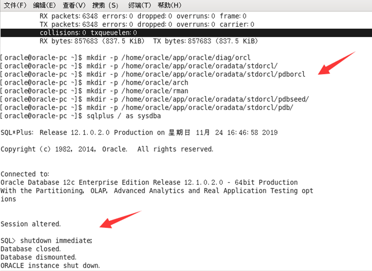
* 启动到nomount
```
$sqlplus / as sysdba
startup nomount
```
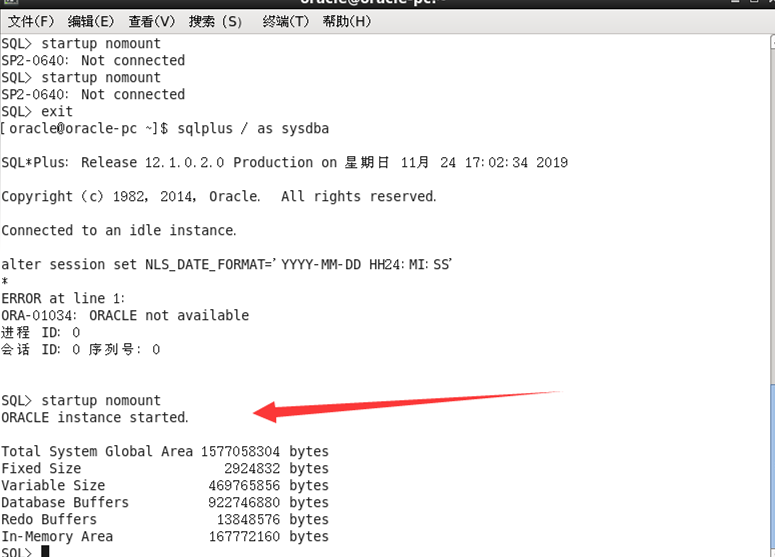

### 7.2 主库
* 连接到数据库
```
$sqlplus /  sysdba
select group#,thread#,members,status from v$log;

alter database add standby logfile  group 5 '/home/oracle/app/oracle/oradata/orcl/stdredo1.log' size 50m;
alter database add standby logfile  group 6 '/home/oracle/app/oracle/oradata/orcl/stdredo2.log' size 50m;
alter database add standby logfile  group 7 '/home/oracle/app/oracle/oradata/orcl/stdredo3.log' size 50m;
alter database add standby logfile  group 8 '/home/oracle/app/oracle/oradata/orcl/stdredo4.log' size 50m;
```
* 主库环境开启强制归档
```
ALTER DATABASE FORCE LOGGING;

alter system set LOG_ARCHIVE_CONFIG='DG_CONFIG=(orcl,stdorcl)' scope=both sid='*';         
alter system set log_archive_dest_1='LOCATION=/home/oracle/arch VALID_FOR=(ALL_LOGFILES,ALL_ROLES) DB_UNIQUE_NAME=orcl' scope=spfile;
alter system set LOG_ARCHIVE_DEST_2='SERVICE=stdorcl LGWR ASYNC  VALID_FOR=(ONLINE_LOGFILES,PRIMARY_ROLE) DB_UNIQUE_NAME=stdorcl' scope=both sid='*';
alter system set fal_client='orcl' scope=both sid='*';    
alter system set FAL_SERVER='stdorcl' scope=both sid='*';  
alter system set standby_file_management=AUTO scope=both sid='*';
alter system set DB_FILE_NAME_CONVERT='/home/oracle/app/oracle/oradata/stdorcl/','/home/oracle/app/oracle/oradata/orcl/' scope=spfile sid='*';  
alter system set LOG_FILE_NAME_CONVERT='/home/oracle/app/oracle/oradata/stdorcl/','/home/oracle/app/oracle/oradata/orcl/' scope=spfile sid='*';
alter system set log_archive_format='%t_%s_%r.arc' scope=spfile sid='*';
alter system set remote_login_passwordfile='EXCLUSIVE' scope=spfile;
alter system set PARALLEL_EXECUTION_MESSAGE_SIZE=8192 scope=spfile;
```
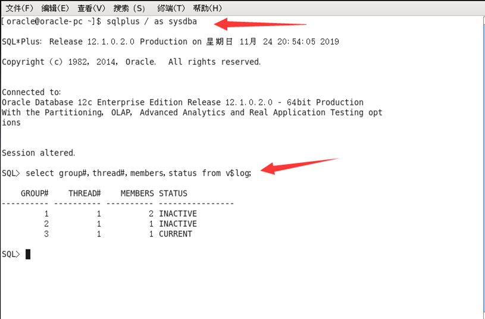
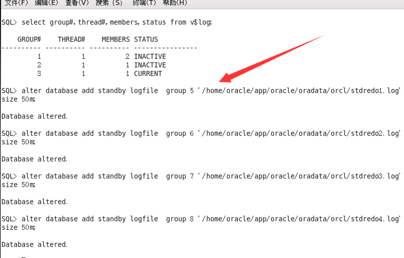
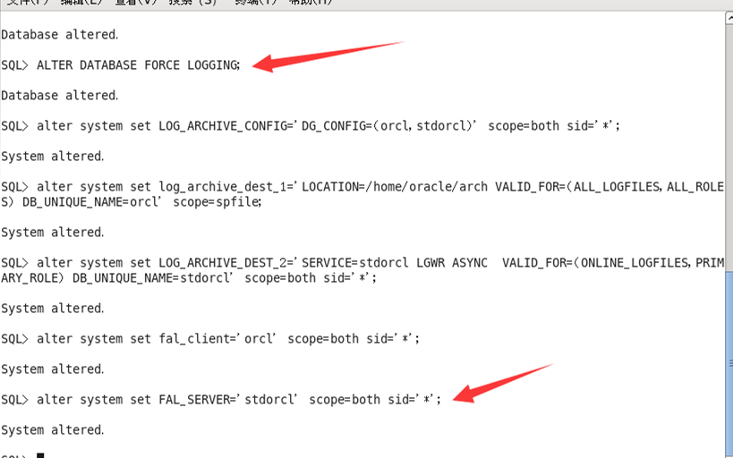
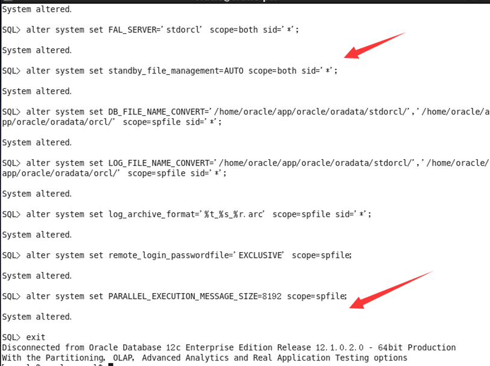

* 编辑主库以及备库的/home/oracle/app/oracle/product/12.1.0/dbhome_1/network/admin/tnsnames.ora文件
注： 此处的ip地址，每个人在进行实验时，或许分配ip地址都不同，在进行文件拷贝之前，最好测试一下主机与从机之间是否能Ping 通
```
$gedit /home/oracle/app/oracle/product/12.1.0/dbhome_1/network/admin/tnsnames.ora

ORCL =
  (DESCRIPTION =
    (ADDRESS_LIST =
      (ADDRESS = (PROTOCOL = TCP)(HOST = 192.168.133.131)(PORT = 1521))
    )
    (CONNECT_DATA =
      (SERVER = DEDICATED)
      (SERVICE_NAME = orcl)
    )
  )

stdorcl =
  (DESCRIPTION =
    (ADDRESS = (PROTOCOL = TCP)(HOST = 192.168.133.133)(PORT = 1521))
    (CONNECT_DATA =
      (SERVER = DEDICATED)
      (SID = orcl)
    )
  )
```
主库的：
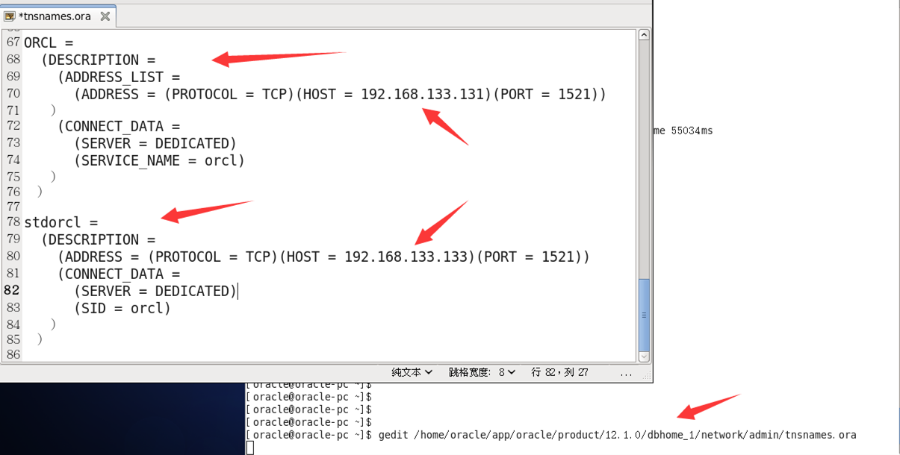
备库的：
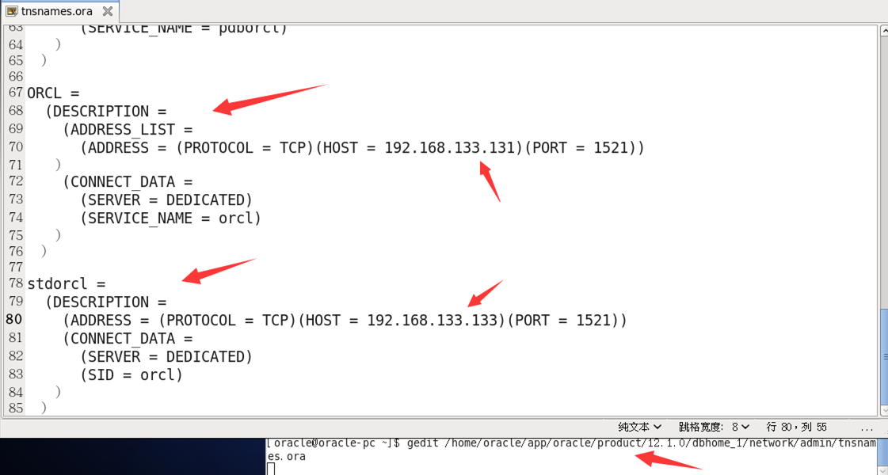

* 在主库上生成备库的参数文件:
```
SQL>create pfile from spfile;
```

生成/home/oracle/app/oracle/product/12.1.0/dbhome_1/dbs/initorcl.ora

* 将主库的参数文件，密码文件拷贝到备库:
```
scp /home/oracle/app/oracle/product/12.1.0/dbhome_1/dbs/initorcl.ora 192.168.133.133:/home/oracle/app/oracle/product/12.1.0/dbhome_1/dbs/
scp /home/oracle/app/oracle/product/12.1.0/dbhome_1/dbs/orapworcl 192.168.133.132:/home/oracle/app/oracle/product/12.1.0/dbhome_1/dbs/
```
注： 此处的ip地址，每个人在进行实验时，或许分配ip地址都不同，在进行文件拷贝之前，最好测试一下主机与从机之间是否能Ping 通
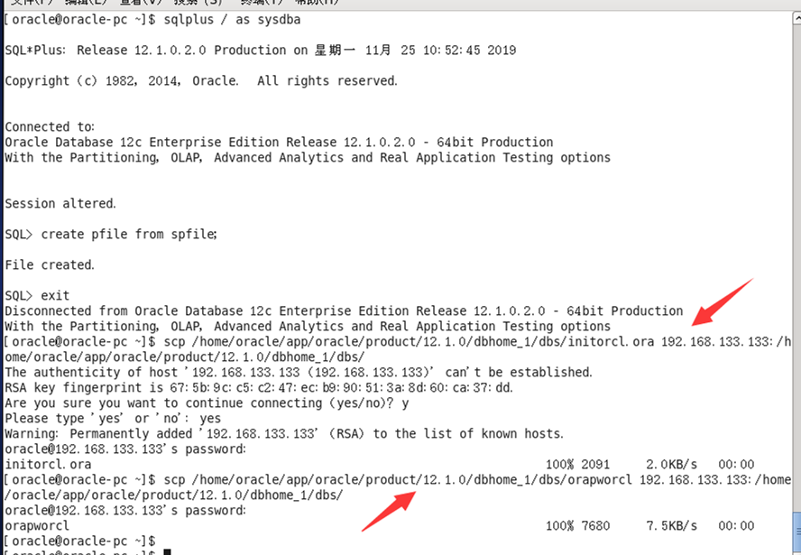
* 将主库复制到备库
```
$rman target sys/123@orcl auxiliary sys/123@stdorcl
```
* 执行duplicate:
```
run{
             
allocate channel c1 type disk;
allocate channel c2 type disk;
allocate channel c3 type disk;
allocate AUXILIARY channel c4 type disk;
allocate AUXILIARY channel c5 type disk;
allocate AUXILIARY channel c6 type disk;
DUPLICATE TARGET DATABASE
  FOR STANDBY
  FROM ACTIVE DATABASE
  DORECOVER
  NOFILENAMECHECK;
release channel c1;
release channel c2;
release channel c3;
release channel c4;
release channel c5;
release channel c6;
}
```
注： 此处过程用时相对来说会比较长，运行的步骤会比较多，请耐心等待。
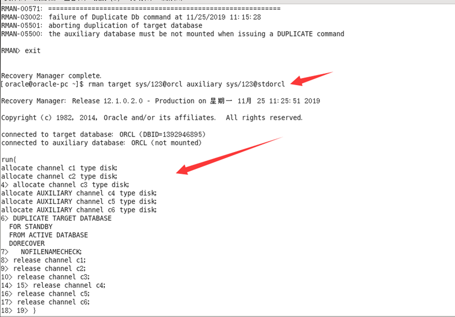
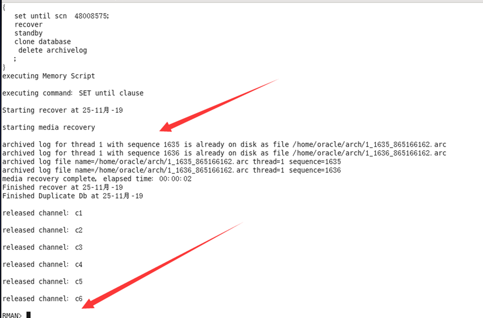
### 7.3 备库
* 在备库上更改参数文件
```
$gedit /home/oracle/app/oracle/product/12.1.0/dbhome_1/dbs/initorcl.ora
```

* 文件内容是：
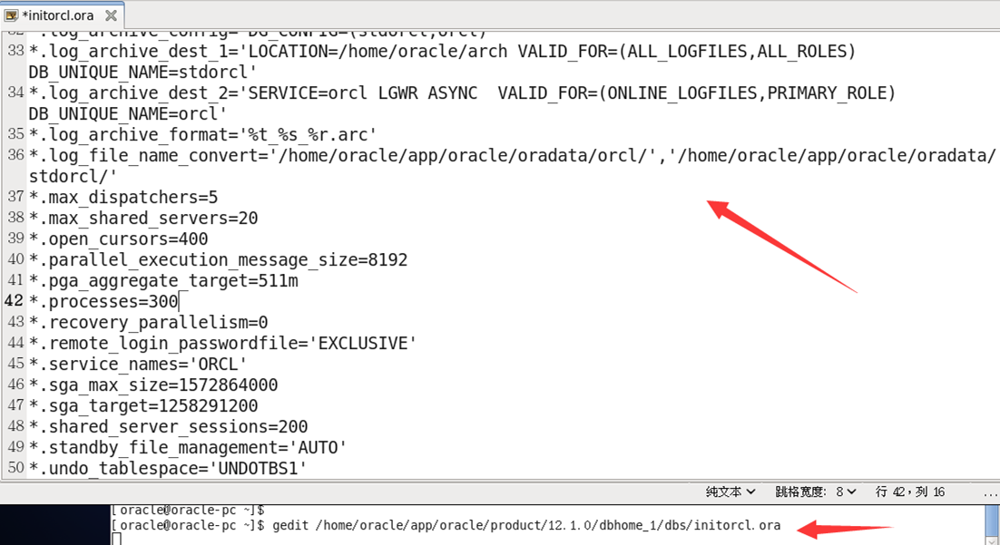
注： 此处为完全替换原来文件中的信息
* 在备库增加静态监听
```
$gedit /home/oracle/app/oracle/product/12.1.0/dbhome_1/network/admin/listener.ora
```
* 文件内增加的信息为：
```
SID_LIST_LISTENER =
  (SID_LIST =
    (SID_DESC =
      (ORACLE_HOME = /home/oracle/app/oracle/product/12.1.0/db_1)
      (SID_NAME = orcl)
    )
  )
```
注： 此处应该增添至文件最后（且记得保存）

* 重新启动,备库开启实时应用模式:
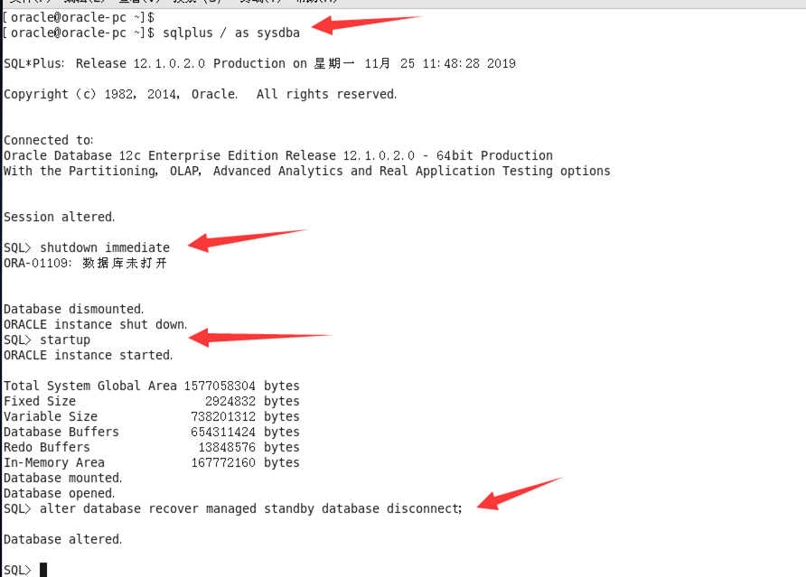

### 7.4 数据同步测试
* 在主库修改数据（ 创建了一张 t1 的表）
```
SQL> create table t1 (id number);

Table created.
```
* 在备库查询修改
```
SQL> select * from t1;

no rows selected.
```
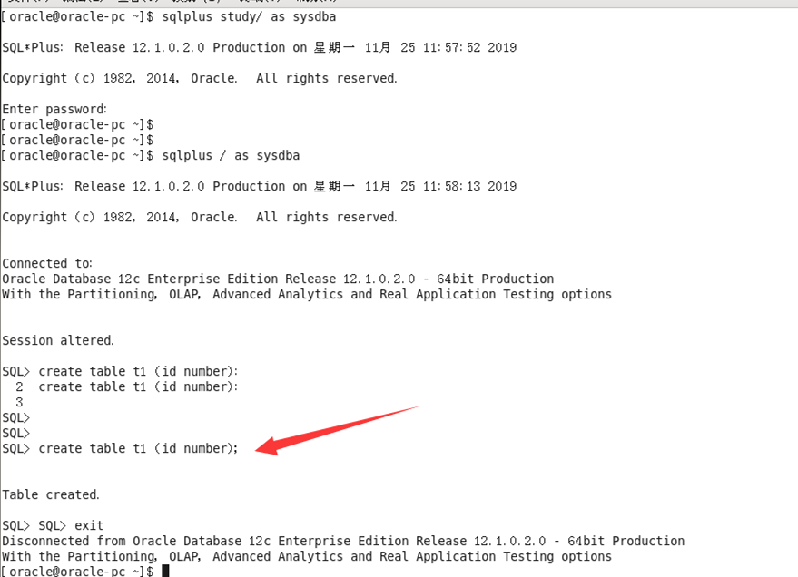
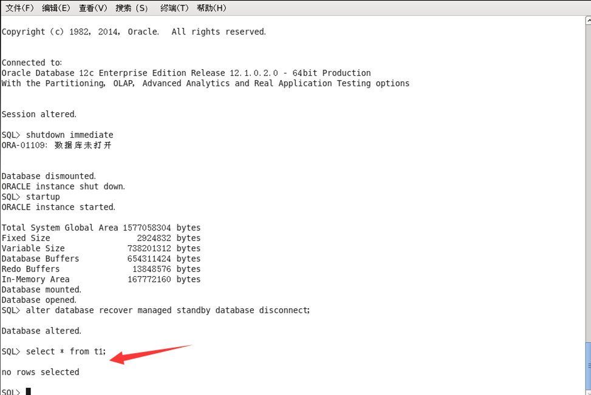

可以看到容灭成功

## 八、总结
在做实验的时候，还是要心细，尤其是写sql语句的时候，一定要主要不要哪里缺了漏了。找起来真的会很麻烦。并且在一些命令运行的时候应该保持耐心等待运行结果，心急而中断操作回带来更麻烦的操作。最后就是，还是要多百度、多查阅资料，来解决所遇到的问题。